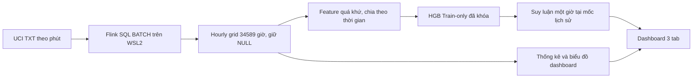

# Bản đồ bằng chứng cho báo cáo điện năng

Các đường dẫn dưới tương đối với `Detaituan8910`. Tài liệu này xác định nguồn có thể trích xuất, không thêm nội dung vào Word/PowerPoint.

## Luồng đã triển khai

Đường huấn luyện đã hoàn tất ở Phase2B1; Phase4 không chạy lại fit. Flink xuất artifact trước, dashboard đọc artifact; không có kết nối dữ liệu công tơ trực tiếp hay streaming job nền.

## Nguồn theo chương

| Phần | Nội dung có evidence | File chuẩn |
| --- | --- | --- |
| Chương3: dữ liệu/thiếu/đơn vị | 2075259 phút, 25979 phút thiếu phép đo; ranh giới giờ,1050 residual âm cần giữ cờ | docs/phase0-20261008/DATA_AUDIT.md; .agent/qa/phase0-resume-20261009/dataset-verification.json; .agent/qa/phase1-full-20261009/review.md |
| Chương3: xử lý bằng Flink | Công suất phút kW → tổng/60 kWh; grid34589, đầy đủ34085, NULL504; SQL BATCH/job thật | pipeline/run_full.py; .agent/qa/phase1-full-20261009/runs/20261009T102201900234-full/job.sql; data/processed/runs/20261009T102201900234-full/{hourly-grid.csv,manifest.json,verification.json} |
| Chương3: thống kê/EDA | Tổng ghi nhận, trung bình/đỉnh chỉ giờ đầy đủ, profile giờ/ngày/tháng, ba nhóm đo phụ; phạm vi ngày/độ phủ cần kèm mỗi biểu đồ | dashboard/{data_service.py,charts.py}; QA4/technical-verification.json; QA4/screenshots/{overview-1920.jpg,analysis-1920.jpg,all-missing-1920.jpg} |
| Chương4: split và feature | Train22513/Validation4727/Test4590; 11feature, lag/rolling không nén qua khoảng thiếu | data/ml/runs/20261009-phase2a-a/{feature-schema.json,split-summary.json,manifest.json}; .agent/qa/phase2a-20261009/review.md |
| Chương4: fit/lựa chọn | HGB fit Train-only, chọn qua Validation; không refit Train+Validation | .agent/qa/phase2b1-20261009/{fit-witness.json,review.md}; models/runs/20261009-phase2b1-a2/manifest.json |
| Chương4: Test chính thức | MAE/RMSE của ba model cùng4590 mốc; D09 và hạn chế one-step rolling origin | models/runs/20261009-phase2b2-a/{metrics-test.json,predictions-test.csv,verification.json}; models/final/hgb-uci-hourly-v1.0-train-only/manifest.json |
| Chương5: kiến trúc/luồng/chức năng | Artifact lineage, ba tab, KPI/NULL/filter/real inference; model không dùng nhãn tương lai | dashboard/{app.py,data_service.py,charts.py}; QA4/{integration-faults.json,technical-verification.json,browser-verification.json}; sơ đồ trên |
| Chương5: vận hành/QA/hạn chế | Khởi động lại đúng ownership, cổng bận, nguồn hỏng, app dùng artifact khi Flink tắt; loopback Windows/WSL | operations/{services.py,README.md}; QA4/{app-off.json,flink-off.json,final.json,windows-runtime.json,review.md} |
| Đồng bộ Chương2 | Flink SQL BATCH, timestamp lịch nguồn, tổng hợp giờ, lag/rolling, split theo thời gian, HGB, MAE/RMSE, D09 | Các code/manifests trên; lý thuyết cần nguồn chính thức riêng, chưa sửa bài của Hậu |

`QA4` = `.agent/qa/phase4-app-20261009`. Đường SQL được kiểm lại ở gate tài liệu; không dùng SQL smoke lịch sử thay cho SQL full đã chạy.

## Quy tắc sử dụng số liệu và ảnh

- Ảnh default20–26/11/2010 phản ánh một khoảng lịch sử, không phải toàn bộ dataset. 190,54kWh là tổng ghi nhận trong khoảng này; không gọi là tổng điện năng năm2010.
- Ba nhóm đo phụ tương ứng khu vực đo, không phải ba hộ hoặc ba thiết bị độc lập. Biểu đồ không có phần “Khác” ép residual âm về0.
- Month chart là tổng ghi nhận phần tháng trong bộ lọc; không ngoại suy tháng thiếu. Profile chỉ tính giờ đầy đủ và phải nêu số mẫu/độ phủ.
- HGB Test MAE0.3220542588291146/RMSE0.4634874854716987kWh, nguồn metric đã khóa, không phải phần trăm accuracy.
- Ảnh dự báo đầu Test chọn24/04/2010 17:00; ảnh cuối chọn26/11/2010 20:00. Giá trị thực tế hiển thị chỉ đối chiếu sau dự báo, không đưa vào model.
- Có thể vẽ lại sơ đồ kiến trúc từ flow và code thật; không tự thêm Kafka, Docker, cloud, watermark, checkpoint hoặc online inference service như thành phần đã triển khai.
- Bằng chứng hiệu năng job full nằm ở manifest/resources Phase1; chưa có benchmark scalability nhiều máy hoặc SLA production.

## Còn thiếu trước hoàn thiện Phase4 và hồ sơ học thuật

I04 DEMO_RUNBOOK/chuẩn bị demo còn tạm hoãn. Nghiệm thu app của Thy/GPT Web chưa thực hiện. Cold boot/autostart và triển khai ngoài máy cá nhân chưa kiểm. Word hiện hành, Chương2 Hậu, PowerPoint và video không được sửa trong lượt này; cần phê duyệt riêng trước biên soạn/đồng bộ.
